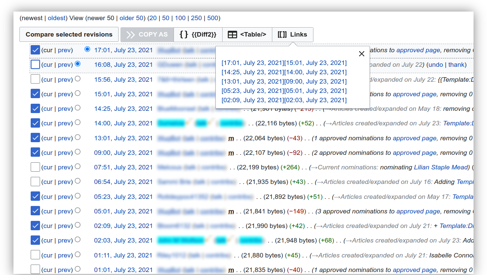
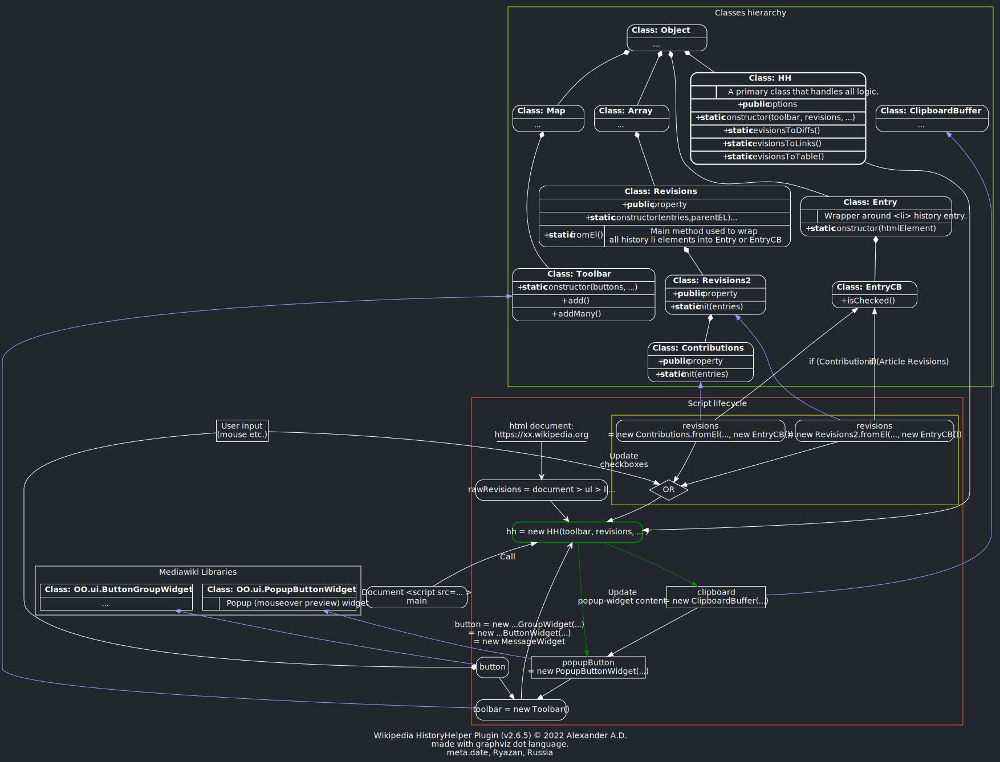

<p align="center"></p>


> A JavaScript Wikipedia Plugin for History & Revisions pages

# HistoryHelper for Wikipedia  
The HistoryHelper plugin (HH) basically helps you to copy & past multiple entries to initiate a discussion of concerning edits. It also can highlight offensive words. It was first pusblished on May 12, 2021.

## Install
You are assumed to have a wikipedia account in order to be able to install this script. Otherwise, you probably would need to install a browser extension that runs user-scripts instead. I do not consider to create a separate plugin for web the browser until paid.

### On wikipedia

> *See: [History Helper Install ](https://en.wikipedia.org/wiki/User:Alexander_Davronov/HistoryHelper#Install) instructions.*


## Usage
Plugin binds a few key strokes. See demons below.
* <kbd>click+drag</kbd> — on checkboxes to select multiple entries simultaneously.
* <kbd>⇧shift+click</kbd> — on checkbox to select multiple entries simultaneously.

### Demos
* <a href="./videos/HistoryHelper Pointer + Shift Demo.mp4">HistoryHelper Pointer + Shift Demo</a>
* <a href="./videos/HistoryHelper Pointer Hold & Drag Demo.mp4">HistoryHelper Pointer Hold & Drag Demo</a>

### Config

By default HH higlights some uncivil words (see line 839 for a fill list). You can add your own words or phrases by using the following config below. Use Regular expression for matching. By default every word is highlighted by using `{{Tl|highlight}}` wikipedia tag

```js
    window.HistoryHelper= window.HistoryHelper || {}; 
    window.HistoryHelper.highlights=[
     // matches liar 2 times, or pants, or "on fire" 
     /(liar){1,2}|pants|on fire/ig
    ];
```


## Development
The plugin is written in JavaScript. The following [dot graph] approximates a script lifecycle and basic classes:


[dot graph]: "https://www.graphviz.org/"


-----
> Created-at: September 10, 2022</br>
> Modified-at: Wed, 24 May 2023 16:11:29 +0300

